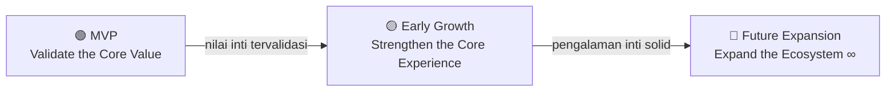
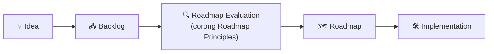

# 03 · Roadmap

> **Status:** 🟢 Terisi (fondasi) · **Dibuat:** 2026-07-17 · **Diperbarui:** 2026-07-18
> **Penanggung jawab:** Mohammad Rifqi Hidayat (Project Owner)

Roadmap ini adalah **rencana evolusi produk** Hearts2spaceU — bukan sekadar daftar fitur. Ia diturunkan langsung dari [`02_product_vision.md`](02_product_vision.md) dan menjadi jembatan menuju keputusan teknis di [`04_architecture.md`](04_architecture.md).

> 🔗 Dalam alur dokumentasi: **Why & What** (`02`) → **When** (`03`, dokumen ini) → **How** (`04`).

---

## 1. Roadmap Principles

Roadmap Principles adalah **pedoman untuk menentukan prioritas** pengembangan. Seluruhnya merupakan **turunan langsung dari [`02_product_vision.md`](02_product_vision.md)**, bukan arah produk baru. Prinsip diterapkan **berurutan** sebagai *corong keputusan* — sebuah inisiatif dievaluasi dari atas ke bawah.

1. **Vision-aligned** — setiap inisiatif harus memperkuat Vision, Mission, dan Product Positioning, serta tetap berada dalam batas Non-Goals Hearts2spaceU.
2. **Value-first** — setiap item roadmap harus memberikan nilai nyata dengan menjawab Problem Statement dan mendukung Value Proposition yang telah ditetapkan.
3. **Primary-Users-first** — prioritas pengembangan selalu didasarkan pada kebutuhan Primary Users. Kebutuhan Secondary Users dan Future Audience dipertimbangkan selama tidak mengurangi pengalaman pengguna utama.
4. **Evidence-informed** — keputusan roadmap dikembangkan berdasarkan bukti yang tersedia, seperti kebutuhan pengguna, hasil evaluasi iterasi sebelumnya, dan pembelajaran selama proses pengembangan.
5. **Incremental & Iterative** — pengembangan dilakukan secara bertahap sehingga setiap fase menghasilkan nilai yang dapat digunakan sebagai dasar pembelajaran untuk fase berikutnya.

> Inisiatif yang **tidak memenuhi** prinsip-prinsip di atas **tidak menjadi bagian roadmap** hingga dievaluasi kembali.

## 2. Phase Definitions

Ketiga fase berikut adalah **tahap evolusi produk**. Setiap fase punya nilai inti yang ingin divalidasi, dan perpindahan antar fase ditentukan oleh **tercapainya tujuan fase sebelumnya**.

| Fase | Tujuan | Pertanyaan utama |
|------|--------|------------------|
| 🟢 **MVP – Validate the Core Value** | Memvalidasi nilai inti Hearts2spaceU sebagai *trusted companion* bagi Primary Users melalui pengalaman fandom yang sederhana namun benar-benar bermanfaat. | "Apakah pengguna benar-benar merasakan nilai utama Hearts2spaceU?" |
| 🟡 **Early Growth – Strengthen the Core Experience** | Menyempurnakan pengalaman inti melalui peningkatan kualitas, kenyamanan, dan kemampuan aplikasi berdasarkan pembelajaran dari MVP. | "Bagaimana membuat pengalaman inti menjadi lebih lengkap, nyaman, dan bernilai?" |
| 🔵 **Future Expansion – Expand the Ecosystem** | Memperluas jangkauan Hearts2spaceU kepada audiens yang lebih luas dan kebutuhan baru tanpa mengubah identitas produk sebagai *trusted companion*. | "Bagaimana Hearts2spaceU dapat berkembang tanpa kehilangan identitasnya?" |

**Kriteria transisi (kualitatif):**
- **MVP → Early Growth** — terdapat bukti kualitatif bahwa Primary Users merasakan nilai inti (mis. mengandalkan aplikasi untuk informasi resmi, berkurangnya kebutuhan berpindah aplikasi, umpan balik positif atas pengalaman inti).
- **Early Growth → Future Expansion** — pengalaman inti dinilai solid, nyaman, dan bernilai (alur inti terasa lengkap dan stabil, umpan balik positif konsisten).
- **Future Expansion** — bersifat **berkelanjutan**, tanpa kriteria akhir.

> Perpindahan antar fase didasarkan pada **tercapainya tujuan fase sebelumnya**, bukan pada waktu ataupun jumlah fitur.

## 3. Capability Mapping

Pemetaan ini berada pada **tingkat konseptual**. Setiap *capability* dapat diwujudkan melalui **beberapa fitur** yang akan didefinisikan pada roadmap yang lebih rinci dan *product backlog* ([`10_backlog.md`](10_backlog.md)). Kolom **Supports Value** menautkan tiap kapabilitas ke *Value Proposition* di [`02_product_vision.md`](02_product_vision.md) agar hubungannya dapat ditelusuri.

| Capability | Fase | Supports Value → `02` |
|------------|------|------------------------|
| **Official Information** *(contoh cakupan: profil grup, member, musik, jadwal, dan informasi resmi lainnya — bukan daftar tetap)* | 🟢 MVP | Trusted Information · Centralized Experience |
| **Latest Updates** | 🟢 MVP | Centralized Experience · Trusted Information |
| **Official Streaming Hub** | 🟢 MVP | Centralized Experience · Trusted Information |
| **Personal Collection** | 🟡 Early Growth | Organized Fandom Experience |
| **Gallery** | 🟡 Early Growth | Centralized Experience · Consistent & Enjoyable Experience |
| **Statistics** | 🟡 Early Growth | Consistent & Enjoyable Experience |
| **Enhanced Fandom Support** | 🟡 Early Growth | Organized Fandom Experience · Consistent & Enjoyable Experience |
| **Multilingual Support** | 🔵 Future Expansion | Consistent & Enjoyable Experience *(aksesibilitas global)* |
| **Future Considerations** *(mis. marketplace, ticketing, atau kemampuan lain)* | 🔵 Future Expansion | *dievaluasi per item — wajib selaras Vision & Non-Goals* |

> **Future Considerations bukan komitmen pengembangan.** Setiap item tetap harus melewati evaluasi **Roadmap Principles** sebelum dijadwalkan, dan wajib selaras dengan Vision serta Non-Goals.

## 4. Roadmap Governance

Bagian ini hanya **penghubung** menuju [`10_backlog.md`](10_backlog.md), bukan penggantinya. Alur sederhana sebuah ide hingga menjadi bagian produk:

Ide baru dikumpulkan di *backlog*, dievaluasi melalui **corong Roadmap Principles**, baru masuk roadmap, lalu diimplementasikan. **Definition of Ready**, **Definition of Done**, dan pengelolaan *backlog* tetap menjadi tanggung jawab [`10_backlog.md`](10_backlog.md).

## 5. Catatan Lintas-Fase

**Security by Stage** — Praktik keamanan (secret management, API key, environment variable, dll.) **sengaja ditunda** sampai project masuk **stage Backend**. Membahasnya sekarang (masih tahap Planning/Flutter) justru membingungkan. Prinsipnya **"Security by Stage"**, bukan "Security by Default"; saat stage Backend dimulai, "Security" diangkat menjadi prinsip aktif.

---

## Dokumen Terkait

| Hubungan | Dokumen |
|----------|---------|
| **Why & What** — sumber roadmap (visi, nilai, positioning) | [`02_product_vision.md`](02_product_vision.md) |
| **How** — keputusan arsitektur & teknis kelanjutan roadmap | [`04_architecture.md`](04_architecture.md) |
| Teknologi (backend, database, cloud, dll.) | [`05_tech_stack.md`](05_tech_stack.md) |
| Backlog, Definition of Ready/Done, detail item | [`10_backlog.md`](10_backlog.md) |

_Turunan dari: [`02_product_vision.md`](02_product_vision.md) · Menuju: [`04_architecture.md`](04_architecture.md)_
