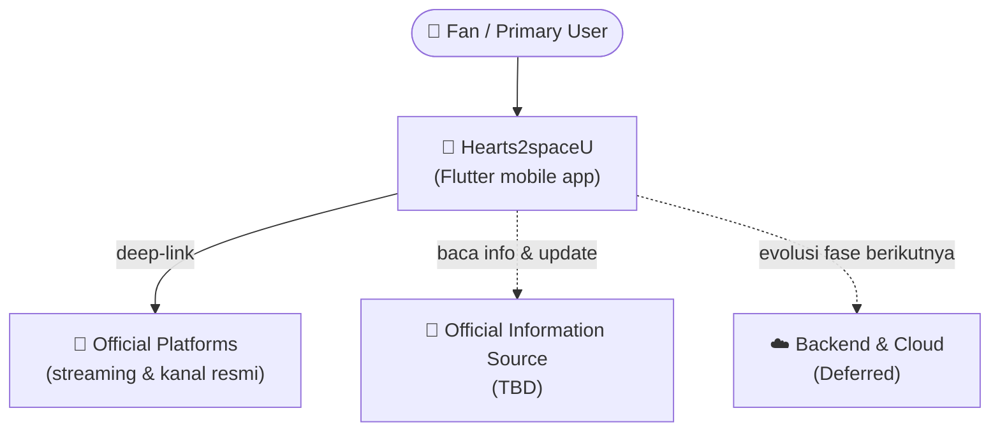
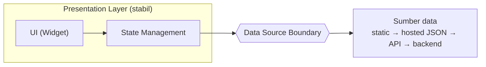

# 04 · Architecture

> **Status:** 🟢 Terisi (MVP) · **Dibuat:** 2026-07-17 · **Diperbarui:** 2026-07-18
> **Penanggung jawab:** Mohammad Rifqi Hidayat (Project Owner)

Dokumen ini menetapkan **keputusan arsitektur yang diperlukan untuk MVP** Hearts2spaceU — yaitu arsitektur **aplikasi Flutter**. Keputusan sistem yang lebih luas sengaja **ditunda** agar arsitektur dapat berkembang bertahap sesuai roadmap. Fokusnya bukan hanya *bagaimana* aplikasi dibangun, tetapi juga **mengapa** setiap keputusan diambil pada saat yang tepat.

> 🔗 Alur dokumentasi: **Vision** (`02`) → **Roadmap** (`03`) → **Architecture** (`04`, dokumen ini) → **Implementation**.

---

## 1. Architecture Scope

`04` memutuskan arsitektur **setingkat aplikasi Flutter untuk MVP**. Keputusan sistem yang lebih luas ditunda ke stage roadmap yang membutuhkannya (dicatat pada [Decision Log](#7-decision-log) sebagai **ADR-002**).

| Diputuskan sekarang (setingkat app) | Ditunda (ke stage masing-masing) |
|-------------------------------------|----------------------------------|
| Prinsip arsitektur | Arsitektur backend (monolith/microservices) |
| Konteks sistem (high-level) | Database |
| Arsitektur aplikasi Flutter | Cloud & deployment |
| Alur data di dalam app | Integrasi FE↔BE (API contract, auth) |
| Strategi testing | Security → *Security by Stage* (stage Backend) |

## 2. Architectural Principles

Sembilan prinsip yang memandu setiap keputusan arsitektur, dikelompokkan agar mudah dipahami.

**🧭 Philosophy** — cara pandang & pendekatan
- **Learning First** — arsitektur yang mudah dipahami dan dijelaskan.
- **Avoid Over-Engineering** — mulai sesederhana mungkin; tambah kompleksitas hanya saat benar-benar perlu.
- **Incremental** — arsitektur tumbuh seiring fase roadmap, bukan sekaligus di depan.
- **Evolutionary Architecture** — arsitektur dirancang agar dapat berkembang mengikuti roadmap tanpa menambah kompleksitas yang belum diperlukan.

**⚙️ Quality Attributes** — properti sistem yang diutamakan
- **Maintainability** — kode sederhana, rapi, mudah dipelihara dan dikembangkan.
- **Testability** — struktur memudahkan pengujian.
- **Separation of Concerns** — batas tanggung jawab tiap bagian jelas.

**🧩 Decision Principles** — kaidah pengambilan keputusan
- **Traceability** — setiap keputusan arsitektur dapat ditelusuri kembali ke Product Vision, Roadmap, atau kebutuhan teknis yang terdokumentasi.
- **Every architectural layer must solve a real problem before it is introduced** — kaidah inti dari ADR-001.

## 3. System Context

Diagram konteks (C4 Level 1) — menetapkan **batas sistem** dan **aktor**.

> Diagram ini hanya menggambarkan **batas sistem pada tingkat konseptual (C4 Level 1)**. Ia **tidak** mencakup detail mekanisme komunikasi maupun teknologi implementasi. Komponen berlabel **Deferred** merupakan bagian dari evolusi arsitektur pada fase berikutnya, bukan implementasi MVP.

## 4. App Architecture — Evolutionary Clean Architecture (ADR-001)

Arsitektur aplikasi memakai **Evolutionary Clean Architecture**: sebuah **strategi evolusi menuju Clean Architecture**, **bukan** penyederhanaan permanen. Aplikasi dimulai *lean* (feature-first + pemisahan `presentation` ↔ `data`), lalu **tiap lapisan Clean Architecture diperkenalkan ketika ia menyelesaikan masalah nyata** — bukan karena polanya "seharusnya" ada.

Dengan begitu, setiap lapisan dipahami *alasan keberadaannya*, dan aplikasi tetap konsisten menuju Clean Architecture seiring bertumbuhnya kompleksitas.

### Kapan setiap lapisan diperkenalkan

| Lapisan | Diperkenalkan ketika… | Solves (masalah yang diselesaikan) |
|---------|------------------------|-------------------------------------|
| **Repository Interface** | ada >1 sumber data, atau butuh abstraksi untuk pengujian | menukar/menambah sumber data & memungkinkan *mocking* saat tes, tanpa mengubah pemanggil |
| **Domain Entity** | model domain mulai berbeda dari representasi data | memisahkan model bisnis dari bentuk data eksternal agar perubahan sumber tak merembet ke logika |
| **Use Case** | muncul *business rule* yang signifikan | menampung aturan bisnis di satu tempat yang jelas & teruji, lepas dari UI dan data |
| **Failure Abstraction** | strategi penanganan error jadi lebih kompleks | penanganan error yang konsisten & bermakna lintas fitur |
| **Mapper** | transformasi data mulai bermakna | memusatkan transformasi antar representasi (data ↔ domain) agar tidak tersebar |

> 📌 Keputusan ini **tidak** secara otomatis mengubah scaffold `lib/` yang ada saat ini. Refactor struktur `lib/` dilakukan pada **tahap implementasi** yang sesuai.

## 5. Data Flow

Alur data di dalam aplikasi bersifat **unidirectional**, dengan **Data Source Boundary** sebagai batas antara aplikasi dan sumber data.

**Prinsip Data Source Boundary:**
- **UI dan State Management tidak bergantung** pada mekanisme pengambilan data.
- Implementasi di balik boundary boleh berevolusi (static data → hosted JSON → API → backend) **tanpa mengubah** Presentation Layer maupun State Management.
- Yang bersifat **arsitektural** adalah **keberadaan boundary**; mekanisme konkret di baliknya adalah **keputusan implementasi**, bukan keputusan arsitektur.

## 6. Testing Strategy

Strategi pengujian **berkembang mengikuti evolusi arsitektur** — lapisan yang belum ada belum memerlukan strategi pengujian khusus.

- **MVP:** **Unit Test** (logika/service) + **Widget Test** (layar/komponen kunci).
- **Integration Test:** diperkenalkan ketika alur aplikasi sudah cukup stabil.

Selaras dengan *Testability* dan *Avoid Over-Engineering*.

## 7. Decision Log

Setiap keputusan arsitektur dicatat sebagai ADR (*Architecture Decision Record*).

| ID | Keputusan | Status | Alasan ringkas |
|----|-----------|--------|----------------|
| **ADR-001** | Evolutionary Clean Architecture | ✅ **Accepted** | Memahami "mengapa" tiap lapisan; selaras Avoid Over-Engineering, Incremental, Evolutionary Architecture. |
| **ADR-002** | Deferred System Architecture (backend, database, cloud, deployment, API contract, security) | ⏸️ **Deferred** | Mengikuti Roadmap & Architecture Scope; menghindari keputusan prematur (*Avoid Over-Engineering*). |

> Bila jumlah ADR bertambah di masa depan, format lengkap ADR dapat dipindahkan ke **direktori atau dokumen ADR tersendiri**.

---

## Penutup

Dokumen ini menjadi **dasar implementasi Flutter pada MVP**. Ia sengaja hanya menetapkan keputusan arsitektur yang diperlukan sekarang, dan akan **ditinjau kembali ketika roadmap memasuki fase yang memerlukan perubahan arsitektur** (mis. saat backend, database, atau cloud mulai dibutuhkan). Dengan pendekatan ini, arsitektur Hearts2spaceU berkembang secara **sadar dan bertahap**, selaras dengan filosofi yang dibangun sejak `01`–`03`.

## Dokumen Terkait

| Hubungan | Dokumen |
|----------|---------|
| **Why & What** — sumber kebutuhan arsitektur | [`02_product_vision.md`](02_product_vision.md) |
| **When** — fase & kapabilitas yang memandu evolusi arsitektur | [`03_roadmap.md`](03_roadmap.md) |
| **Teknologi** — pustaka & tools konkret (state management, dll.) | [`05_tech_stack.md`](05_tech_stack.md) |
| **Backlog** — detail item & Definition of Ready/Done | [`10_backlog.md`](10_backlog.md) |

_Turunan dari: [`02_product_vision.md`](02_product_vision.md) · [`03_roadmap.md`](03_roadmap.md)_
