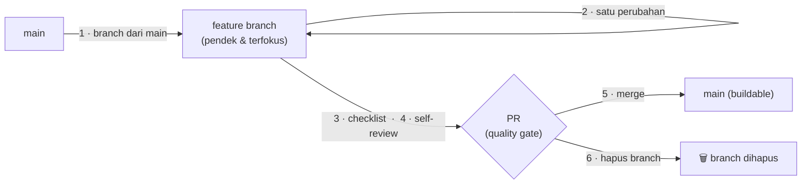

# 07 · Git Workflow

> **Status:** 🟢 Terisi · **Dibuat:** 2026-07-17 · **Diperbarui:** 2026-07-18
> **Penanggung jawab:** Mohammad Rifqi Hidayat (Project Owner)

Dokumen ini mengatur cara mengelola versi kode. **Git** adalah langkah terakhir pada alur kerja proyek ([`08`](08_ai_guidelines.md)), tetapi aturannya disepakati lebih awal agar konsisten.

---

## 1. Version Control

| Item | Keputusan | Traceability |
|------|-----------|--------------|
| Tool | **Git** | Standar industri; mendukung workflow proyek |
| Hosting | **GitHub (repository publik)** | Ditetapkan di [`01`](01_project_overview.md) — belajar & portofolio "in the open" |

## 2. Branching Strategy — **GitHub Flow**

> **Prinsip inti: _Branches are temporary; `main` is the single source of truth._**

- Setiap pekerjaan dilakukan pada **feature branch berumur pendek**.
- Setelah selesai dan di-*merge*, **branch dihapus**.
- **`main` harus selalu dalam kondisi *buildable*** dan menjadi representasi terbaru proyek.

**Alasan (traceability):**
- **Learning First** — cukup sederhana untuk dipelajari & diterapkan konsisten.
- **Avoid Over-Engineering** — tanpa `develop`/`release`/`hotfix` branch yang belum diperlukan.
- **Review** ([`08`](08_ai_guidelines.md)) — setiap perubahan melewati *self-review* sebelum *merge*.
- **Repo publik** ([`01`](01_project_overview.md)) — mudah dipahami bila proyek menjadi kolaboratif.

> 🔄 Sesuai *Evolutionary Architecture*: bila kompleksitas tim atau proses rilis meningkat, strategi ini dapat dievaluasi kembali. Tidak menambah `develop` branch atau Git Flow sebelum ada kebutuhan nyata.

**Penamaan branch** (untuk konsistensi): `feature/latest-updates` · `fix/navigation` · `docs/architecture` · `refactor/home-module`.

## 3. Merge Workflow

1. Buat **feature branch** dari `main`.
2. Kerjakan **satu perubahan yang terfokus**.
3. Jalankan **checklist** (`dart format`, `flutter analyze`, test terkait — lihat [`06`](06_coding_guidelines.md)).
4. Lakukan **self-review** sebelum membuka PR.
5. **Merge** ke `main` melalui PR.
6. **Hapus** feature branch.

> 🔑 Untuk proyek solo, **PR berfungsi sebagai *quality gate***, bukan sekadar media kolaborasi. Tujuannya **memisahkan fase implementasi dan fase review** agar disiplin *engineering* tetap terjaga meskipun hanya ada satu developer.

## 4. Commit Conventions — Conventional Commits

- Format: **`type(scope): subject`**.
- Tipe umum: `feat`, `fix`, `docs`, `refactor`, `chore`, `test`, `style`, `build`.
- **Bahasa commit: Inggris** — konsisten dengan repo publik/global & tujuan portofolio.
- Subject ringkas & imperatif (mis. `feat(home): add latest updates section`).

## 5. Pull Request Conventions

- Deskripsi PR menjelaskan **apa** & **mengapa**, serta tautan ke item/konteks terkait bila ada.
- PR wajib **lolos checklist `06`** sebelum di-*merge*.
- **Small Pull Requests** — usahakan setiap PR tetap **kecil dan berfokus pada satu tujuan** agar review lebih mudah (selaras filosofi *feature branch* pendek).
- **Hindari menggabungkan beberapa fitur yang tidak berkaitan** dalam satu PR.
- Riwayat dijaga tetap bersih (mis. *squash* commit kecil bila perlu).

## 6. `.gitignore`

- Gunakan `.gitignore` standar Flutter.
- Pastikan **artefak build** (`build/`, `.dart_tool/`), **secret**, dan **file environment** **tidak** ikut ter-commit.

## 7. Tagging & Release

- Skema versi: **SemVer** (`vMAJOR.MINOR.PATCH`) — diterapkan **ketika rilis mulai dibutuhkan**.
- Pra-MVP, penandaan rilis belum diperlukan (*Avoid Over-Engineering*).

---

## Checklist Setup Awal (saat Git diaktifkan)

> ℹ️ Repository belum di-inisialisasi Git hingga saat ini.

- [ ] `git init` di root `Hearts2spaceU/`
- [ ] Buat `.gitignore` yang sesuai (Flutter)
- [ ] Commit pertama: fondasi dokumentasi (`docs/`, `.ai/`, `README.md`)
- [ ] Hubungkan ke remote GitHub (publik)

## Dokumen Terkait

| Hubungan | Dokumen |
|----------|---------|
| Alur kerja proyek (tahap Review & Git) | [`08_ai_guidelines.md`](08_ai_guidelines.md) |
| Checklist sebelum commit | [`06_coding_guidelines.md`](06_coding_guidelines.md) |
| Backlog & item pekerjaan | [`10_backlog.md`](10_backlog.md) |

_Turunan dari: [`08_ai_guidelines.md`](08_ai_guidelines.md) · [`06_coding_guidelines.md`](06_coding_guidelines.md)_
