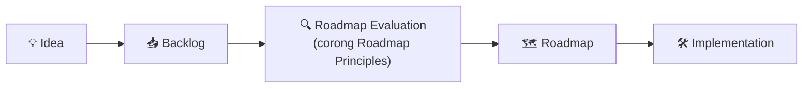

# 10 · Backlog

> **Status:** 🟢 Aktif · **Dibuat:** 2026-07-17 · **Diperbarui:** 2026-07-18
> **Penanggung jawab:** Mohammad Rifqi Hidayat (Project Owner)

Backlog adalah **manifestasi operasional** dari fondasi proyek — tempat ide, fitur, dan tugas berkumpul sebelum dijadwalkan. Sesuai *Incremental Development*, item di sini **tidak dikerjakan** sampai lolos evaluasi dan masuk [Roadmap](03_roadmap.md).

> 🔗 Backlog adalah tahap **Idea → Backlog** pada *Roadmap Governance* ([`03`](03_roadmap.md)). Definition of Ready/Done di sinilah yang dirujuk oleh dokumen lain.

---

## 1. Alur (dari `03` Governance)

1. Ide baru masuk **Inbox**.
2. Dipilah → diberi **tipe & prioritas** → menjadi *backlog item*.
3. Dievaluasi lewat **corong Roadmap Principles** (`03`) dan **Definition of Ready**.
4. Bila lolos → **pindah ke Roadmap** → dikerjakan.

## 2. Legenda

- **Prioritas:** 🔴 High · 🟡 Medium · 🟢 Low
- **Status:** 💡 Idea · 📋 Ready · 🚧 In Progress · ✅ Done · ❄️ Deferred
- **Tipe:** `feature` · `bug` · `chore` · `docs` · `research`

## 3. Definition of Ready (DoR)

Sebuah item **siap dikerjakan** ketika:

- [ ] **Deskripsi jelas** dan tujuannya dipahami.
- [ ] **Tertelusur** ke Vision / Value Proposition / Roadmap (*Traceability*).
- [ ] **Lolos corong Roadmap Principles** (`03`): Vision-aligned → Value-first → Primary-Users-first → Evidence-informed → Incremental.
- [ ] **Acceptance criteria** terdefinisi (bagaimana kita tahu item selesai).
- [ ] **Dependensi** diketahui.
- [ ] Cukup dipahami untuk dikerjakan (tidak ambigu / tidak terlalu besar).

## 4. Definition of Done (DoD)

Sebuah item **dianggap selesai** ketika:

- [ ] Memenuhi seluruh **acceptance criteria**.
- [ ] **Lolos checklist `06`** — `dart format`, `flutter analyze` bersih, test terkait lulus.
- [ ] **Test menguji perilaku** yang relevan (sesuai `06`).
- [ ] **Di-merge sesuai GitHub Flow `07`** (feature branch → PR/self-review → merge → hapus branch).
- [ ] **Dokumentasi diperbarui** bila perlu (mis. ADR di `04`, README, atau dependency di `05`).
- [ ] **`main` tetap *buildable***.

## 5. Template Backlog Item

Setiap item sebaiknya memuat:

| Field | Isi |
|-------|-----|
| **ID** | `B-xxx` |
| **Judul** | ringkas & jelas |
| **Tipe** | feature / bug / chore / docs / research |
| **Prioritas** | High / Medium / Low |
| **Status** | Idea / Ready / In Progress / Done / Deferred |
| **Deskripsi** | apa & mengapa |
| **Supports Value** | tautan ke Value Proposition / kapabilitas (`02`/`03`) |
| **Acceptance Criteria** | daftar kriteria selesai |
| **Catatan** | dependensi, risiko, dll. |

---

## 6. Inbox (belum dipilah)

> Tempat menaruh ide mentah secepat mungkin sebelum lupa.

- [ ] **`CONTRIBUTING.md`** (root project) — panduan **ringkas** kontributor: cara setup, membuat branch, aturan commit, membuka PR; merujuk ke [`07_git_workflow.md`](07_git_workflow.md) & [`06_coding_guidelines.md`](06_coding_guidelines.md). Dibuat **saat repository dipublikasikan**, bukan sekarang. *(praktik umum open source; `docs/07` tetap dokumentasi lengkap, `CONTRIBUTING.md` versi ringkasnya)*

## 7. Backlog Items

| ID | Judul | Tipe | Prioritas | Status | Supports Value | Catatan |
|------|-------|------|-----------|--------|----------------|---------|
| _(belum ada)_ | | | | | | |

---

## Dokumen Terkait

| Hubungan | Dokumen |
|----------|---------|
| Corong prinsip & fase (evaluasi item) | [`03_roadmap.md`](03_roadmap.md) |
| Nilai produk (traceability item) | [`02_product_vision.md`](02_product_vision.md) |
| Checklist kualitas (bagian DoD) | [`06_coding_guidelines.md`](06_coding_guidelines.md) |
| Alur merge (bagian DoD) | [`07_git_workflow.md`](07_git_workflow.md) |

_Turunan dari: [`03_roadmap.md`](03_roadmap.md)_
