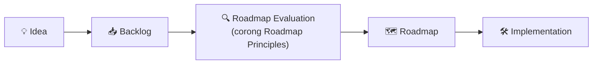

# 10 · Backlog

> **Status:** 🟢 Aktif · **Dibuat:** 2026-07-17 · **Diperbarui:** 2026-08-21
> **Penanggung jawab:** Mohammad Rifqi Hidayat (Project Owner)

Backlog adalah **manifestasi operasional** dari fondasi proyek — tempat ide, fitur, dan tugas berkumpul sebelum dijadwalkan. Sesuai *Incremental Development*, item di sini **tidak dikerjakan** sampai lolos evaluasi dan masuk [Roadmap](03_roadmap.md).

> 🔗 Backlog adalah tahap **Idea → Backlog** pada *Roadmap Governance* ([`03`](03_roadmap.md)). Definition of Ready/Done di sinilah yang dirujuk oleh dokumen lain.

---

## 1. Alur (dari `03` Governance)

```mermaid
flowchart LR
    I["💡 Idea"] --> B["📥 Backlog"] --> E["🔍 Roadmap Evaluation<br/>(corong Roadmap Principles)"] --> R["🗺️ Roadmap"] --> M["🛠️ Implementation"]
```

1. Ide baru masuk **Inbox**.
2. Dipilah → diberi **tipe & prioritas** → menjadi *backlog item*.
3. Dievaluasi lewat **corong Roadmap Principles** (`03`) dan **Definition of Ready**.
4. Bila lolos → **pindah ke Roadmap** → dikerjakan.

## 2. Legenda

- **Prioritas:** 🔴 High · 🟡 Medium · 🟢 Low
- **Status:** 💡 Idea · 📋 Ready · 🚧 In Progress · ✅ Done · ❄️ Deferred
- **Tipe:** `feature` · `bug` · `chore` · `docs` · `research`

## 3. Definition of Ready (DoR)

Sebuah item **siap dikerjakan** ketika:

- [ ] **Deskripsi jelas** dan tujuannya dipahami.
- [ ] **Tertelusur** ke Vision / Value Proposition / Roadmap (*Traceability*).
- [ ] **Lolos corong Roadmap Principles** (`03`): Vision-aligned → Value-first → Primary-Users-first → Evidence-informed → Incremental.
- [ ] **Acceptance criteria** terdefinisi (bagaimana kita tahu item selesai).
- [ ] **Dependensi** diketahui.
- [ ] Cukup dipahami untuk dikerjakan (tidak ambigu / tidak terlalu besar).

## 4. Definition of Done (DoD)

Sebuah item **dianggap selesai** ketika:

- [ ] Memenuhi seluruh **acceptance criteria**.
- [ ] **Lolos checklist `06`** — `dart format`, `flutter analyze` bersih, test terkait lulus.
- [ ] **Test menguji perilaku** yang relevan (sesuai `06`).
- [ ] **Di-merge sesuai GitHub Flow `07`** (feature branch → PR/self-review → merge → hapus branch).
- [ ] **Dokumentasi diperbarui** bila perlu (mis. ADR di `04`, README, atau dependency di `05`).
- [ ] **`main` tetap *buildable***.

## 5. Template Backlog Item

Setiap item sebaiknya memuat:

| Field | Isi |
|-------|-----|
| **ID** | `B-xxx` |
| **Judul** | ringkas & jelas |
| **Tipe** | feature / bug / chore / docs / research |
| **Prioritas** | High / Medium / Low |
| **Status** | Idea / Ready / In Progress / Done / Deferred |
| **Deskripsi** | apa & mengapa |
| **Supports Value** | tautan ke Value Proposition / kapabilitas (`02`/`03`) |
| **Acceptance Criteria** | daftar kriteria selesai |
| **Catatan** | dependensi, risiko, dll. |

---

## 6. Inbox (belum dipilah)

> Tempat menaruh ide mentah secepat mungkin sebelum lupa.

- _(kosong)_ — `CONTRIBUTING.md` sudah dipilah menjadi **B-012** di §7.

## 7. Backlog Items

> **Dipanen, bukan dikarang.** Setiap item di bawah adalah penundaan yang **sudah tertulis**
> di spec atau dokumen fondasi, lengkap dengan alasannya. Kolomnya mengikuti Template §5;
> `Supports Value` menunjuk ke [`02`](02_product_vision.md) §5 lewat kapabilitas di
> [`03`](03_roadmap.md) §3. Ide yang tidak bisa ditelusuri ke sana belum layak masuk tabel ini.

| ID | Judul | Tipe | Prioritas | Status | Supports Value | Catatan |
|------|-------|------|-----------|--------|----------------|---------|
| **B-001** | Reminders — notifikasi lokal opt-in per item Agenda | `feature` | 🔴 High | ❄️ Deferred | Organized Fandom Experience *(Enhanced Fandom Support)* | Penundaan tertulis tiga kali: [`agenda.md`](specs/agenda.md) §8, [`schedule.md`](specs/schedule.md) §2, [`voting-hub.md`](specs/voting-hub.md) §2 & §8 — bukti internal terkuat yang ada. Harganya beda kelas: satu dependency baru, izin `POST_NOTIFICATIONS` (Android 13+), otorisasi iOS, dan zona waktu **sungguhan** yang menabrak asumsi zona waktu tunggal [`schedule.md`](specs/schedule.md) §4. `buildAgenda` sudah menjawab "apa yang layak diingatkan" sebagai fungsi murni teruji, jadi sprintnya tinggal menangani lapisan platform. **Kandidat terkuat sprint berikutnya.** |
| **B-002** | Deployment Strategy — build, signing, rilis store | `chore` | 🔴 High | ❄️ Deferred | *seluruh Value* — tanpa ini aplikasi tidak sampai ke pengguna | ADR-002 masih ⏸️ Deferred ([`04`](04_architecture.md) §7), dan [`05`](05_tech_stack.md) §4 menaruh Deployment Strategy di Deferred Technologies. [`05`](05_tech_stack.md) §6 mencatat akibatnya: CI sudah berjalan, tetapi build artefak, signing, dan rilis store semuanya menunggu keputusan ini. Satu-satunya item yang memblokir rilis nyata, bukan sekadar fitur berikutnya. |
| **B-003** | Tracklist rilis pada Discography | `chore` | 🟡 Medium | ❄️ Deferred | Trusted Information · Centralized Experience *(Discography)* | Tujuh rilis di `assets/data/discography.json` masih `tracks: []` sejak Design System V2, yang sengaja memilih data tingkat-rilis saja daripada menampilkan panel kosong. **Terblokir pada kurasi data dari sumber resmi, bukan pada kode** — begitu daftarnya ada, pekerjaannya kecil. |
| **B-004** | Membuka tautan resmi yang sudah tersimpan | `feature` | 🟡 Medium | 💡 Idea | Trusted Information · Centralized Experience | Tiga spec menyimpan URL resmi tetapi menunda **membukanya**: `officialUrl` ([`schedule.md`](specs/schedule.md) §4), `officialProfileUrl` ([`official-information.md`](specs/official-information.md) §4), `sourceUrl` ([`latest-updates.md`](specs/latest-updates.md) §4). Datanya sudah ada di ketiganya dan `UrlOpener` sudah dipakai Music & Voting — penundaannya kini tinggal soal keputusan UI, bukan soal kemampuan. |
| **B-005** | Foto member asli menggantikan placeholder avatar | `feature` | 🟢 Low | ❄️ Deferred | Trusted Information *(Official Information)* | [`official-information.md`](specs/official-information.md) §2 memakai placeholder avatar sejak Sprint 1 dan menunda aset gambarnya. Sama seperti B-003, hambatannya penyediaan aset resmi. |
| **B-006** | Menampilkan `imageUrl` pada Latest Updates | `feature` | 🟢 Low | ❄️ Deferred | Consistent & Enjoyable Experience *(Latest Updates)* | [`latest-updates.md`](specs/latest-updates.md) §4 menyimpan `imageUrl` tetapi menunda menampilkannya. `RemoteImage` sudah ada sejak Design System V2, jadi biayanya kini lebih rendah daripada saat penundaan ditulis. |
| **B-007** | Caching gambar | `chore` | 🟢 Low | ❄️ Deferred | Consistent & Enjoyable Experience | [`gallery.md`](specs/gallery.md) §2 menunda `cached_network_image` "sampai terbukti perlu" — Dependency Policy [`05`](05_tech_stack.md) §5. Pemicunya adalah bukti keluhan performa, bukan jumlah gambar. |
| **B-008** | Evolusi Personal Collection — koleksi bernama, catatan, rating | `feature` | 🟢 Low | ❄️ Deferred | Organized Fandom Experience *(Personal Collection)* | Jalur evolusinya sudah ditulis di [`personal-collection.md`](specs/personal-collection.md) §9. Menghidupkan kembali pemicu ADR-002: `Set<String>` di `shared_preferences` → local database. [`agenda.md`](specs/agenda.md) §0 menegaskan ini **bukan** bagian Enhanced Fandom Support. |
| **B-009** | Acara multi-hari menampilkan rentang tanggal | `feature` | 🟢 Low | 💡 Idea | Organized Fandom Experience *(Schedule)* | `Event` belum punya tanggal selesai — batasan yang diketahui dan tercatat di [`schedule.md`](specs/schedule.md) §4. [`agenda.md`](specs/agenda.md) §8 mencatat dampaknya: acara multi-hari muncul di tanggal mulai lalu hilang, padahal masih berlangsung. Menyentuh dua fitur sekaligus. |
| **B-010** | Filter "Saved only" pada Agenda | `feature` | 🟢 Low | ❄️ Deferred | Organized Fandom Experience *(Enhanced Fandom Support)* | [`agenda.md`](specs/agenda.md) §8 menundanya karena menuntut kontrol filter yang belum ada di Design System V2, dan satu daftar pendek belum membutuhkannya. Pemicunya panjang daftar, bukan permintaan fitur. |
| **B-011** | Pintu masuk kedua ke Agenda (tile di More) | `feature` | 🟢 Low | 💡 Idea | Organized Fandom Experience *(Enhanced Fandom Support)* | [`agenda.md`](specs/agenda.md) §8. Menuntut satu pasang `CapabilityGradients` baru; [`design-system-v2.md`](design-system-v2.md) §9 mensyaratkan hue yang tidak bertabrakan dengan tujuh yang sudah ada dan **bukan** violet. Warnanya keputusan PO. Kerjakan hanya bila Agenda terbukti kurang terlihat dengan satu pintu masuk. |
| **B-012** | `CONTRIBUTING.md` di root project | `docs` | 🟢 Low | ❄️ Deferred | *tidak menambah nilai produk* — kebutuhan kolaborasi, bukan fitur | Panduan ringkas kontributor: setup, branch, aturan commit, membuka PR; merujuk ke [`07`](07_git_workflow.md) & [`06`](06_coding_guidelines.md). Pemicunya jelas: **saat repository dipublikasikan**, bukan sekarang. `docs/07` tetap dokumentasi lengkapnya. |

---

## Dokumen Terkait

| Hubungan | Dokumen |
|----------|---------|
| Corong prinsip & fase (evaluasi item) | [`03_roadmap.md`](03_roadmap.md) |
| Nilai produk (traceability item) | [`02_product_vision.md`](02_product_vision.md) |
| Checklist kualitas (bagian DoD) | [`06_coding_guidelines.md`](06_coding_guidelines.md) |
| Alur merge (bagian DoD) | [`07_git_workflow.md`](07_git_workflow.md) |

_Turunan dari: [`03_roadmap.md`](03_roadmap.md)_
